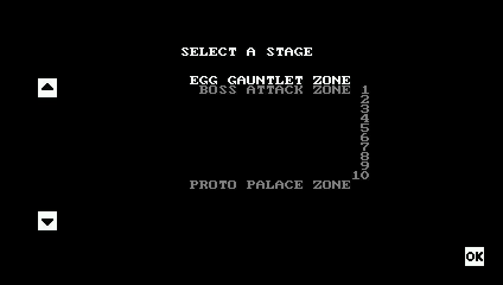
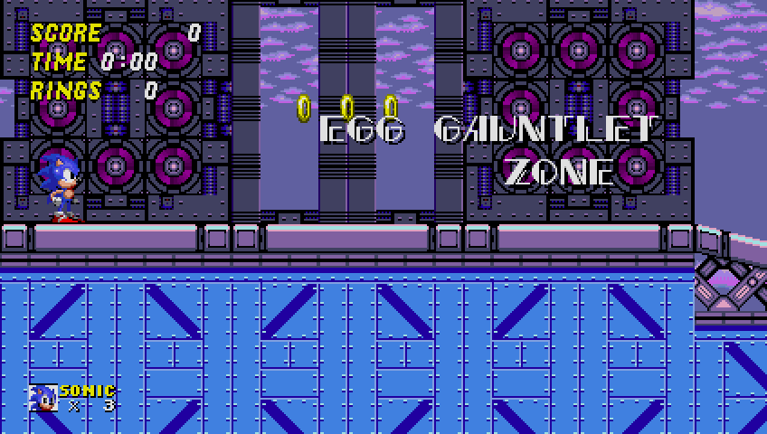
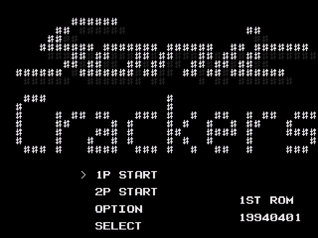
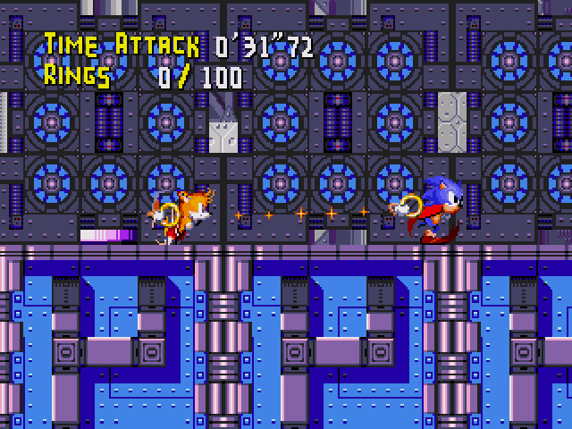
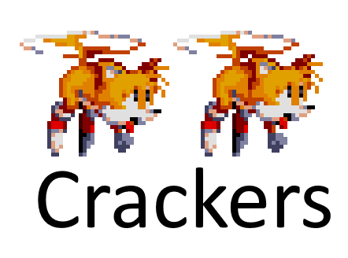

# lavesiime.github.io
***
# The Initial Irregularity

Hello and welcome to the Lave sIime Blog (title pending)! Based on a random idea I had, I'm now gonna write random blogs every now and then based on interesting tidbits of information in my mind.

Our first topic can be found in Sonic the Hedgehog 2, more specifically the 2013 remake developed by The Taxman and Stealth, released on mobile devices in 2013. More specifically, the topic is located tucked away in the Bonus Stage List menu, under the name of "Egg Gauntlet Zone." Going into it...

 
<!--  --> 
 

What? This is totally unlike anything seen in the normal game!

Playing through it, it's a very expansive level that features every normal boss in the game, with the sections inbetween them containing small platforming challenges inspired by the level the upcoming boss hails from. This level uses recoloured versions of the main game's assets, featuring seemingly a ton of new art too - what could be going on here? Why is there all this new stuff, but scrapped and hidden away in the end?

Well to answer that, we'll have to travel back. All the way back to 1994, to be exact!

 

 

A prototype of what would later become Knuckles' Chaotix, _Sonic Crackers_ is a bit of an anomaly. It was seemingly built on April 1st, 1994, according to the date at the bottom left corner of the screen. It's very much an early work-in-progress, with many signs indicating so - no sound effects, a basic title screen, and loads of bugs. Beyond the base idea and music, it's practically an entirely different game from the final product it would end up being. Even the console the game was on would change - while Sonic Crackers is on the normal Sega Mega Drive, Knuckles' Chaotix would end up using the Sega 32X as its platform, allowing for much greater use of the technology, featuing things like expanded colour palette limits and 3d. That's all beside the point though, the point of this blog entry is to only talk about the aforementioned level art, so let's get back to that!

First things first though, this menu's pretty basic. There are only a few levels in this prototype, but the one that interests us is found a level itself, rather than the menus. If we go ahead and select the "1P START" option, then we get sent to an interesting level...

 

 

Well, that art certainly looks familiar! Featuring the same blues and greys as the stage seen before, it seems this is the original source of the level art was this old prototype. Quite an obscure source to take art from, but this isn't the only time this remake took art from this prototype! In fact, unused in this prototype are some tired flying sprites for Tails. These would later get recoloured and used in this remake, for the purpose of illustrating exactly what they show. A comparison between the two can be found below.

 

 

This whole thing is certainly quite interesting, it shows us that the remake's developers had knowledge not only about the prototype's existence, but also how to thoroughly extract materials from it as well.

