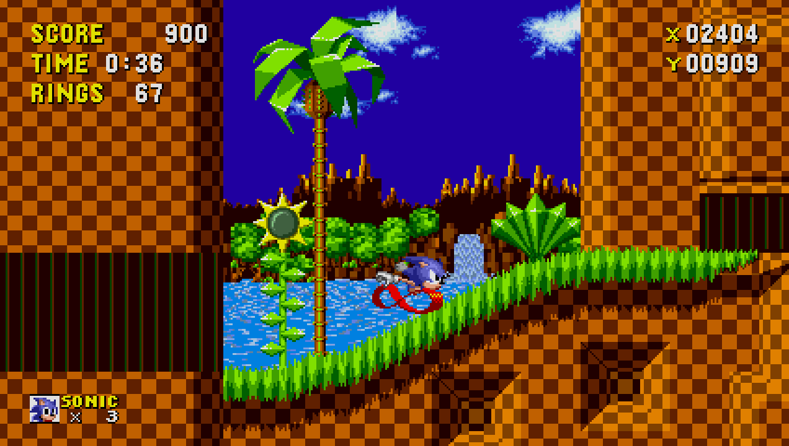

# lavesiime.github.io
***
# Adding the Super Peel Out to Sonic 1 (2013)

This guide covers porting Sonic CD's Super Peel Out to Sonic 1 2013. This is going to be based off the decompiled scripts by Rubberduckycooly, which also means that the RSDKv4 decompilation is needed and this cannot be run on the original release. Without further ado, let's get started!

## What you'll need

* Sonic the Hedgehog 1 (2013)
* [RSDKv4 decompilation](https://github.com/Rubberduckycooly/Sonic-1-2-2013-Decompilation)
* [Decompiled Sonic 1 scripts](https://github.com/Rubberduckycooly/Sonic-1-Sonic-2-2013-Script-Decompilation)
* [Decompiled Sonic CD scripts](https://github.com/Rubberduckycooly/Sonic-CD-2011-Script-Decompilation)
* Any text editor

No sprite editor is needed to add the sprites for reasons coming up.

## The Steps

Alright, now here's the fun stuff!

So, first we'll need to make a minor adjustment in order to have the Peel Out animation actually show up. If you're observant, you'll have noticed that there are already several mentions of the Peel Out animation in the scripts, as well as the sprites being present on Sonic's sheet. Because Sonic 1 was based on Sonic CD, the Peel Out animation is still fully functional, or at least it would be if it weren't for a single line. Which line is that? Well, in the player object's startup code, the Peel Out animation is replaced with the running animation via a `ANI_PEELOUT = ANI_RUNNING` line. If that is removed, the animation will show up when it should. This also means that we can now port the Peel Out and have it show up correctly.

Now, how is the Peel Out triggered? Looking up and pressing jump, right? So, let's take a look at what CD does to trigger it. In the looking up state, we find this:

<details>
<summary>Original CD Code - Looking Up</summary>

```v
function PlayerObject_LookingUp

	if Player.Up==false
		Player.State=PlayerObject_HandleGround
		Player.Timer=0
	else
		if Player.Timer<60
			Player.Timer++
		else
			if Player.LookPos>-112
				Player.LookPos-=2
			endif
		endif
		if Player.Gravity==true
			Player.State=PlayerObject_HandleAir
			Player.Timer=0
		else
			if Player.JumpPress==true
				CallFunction(Player.PeeloutFunction)
			endif
		endif
	endif

endfunction
```

</details>


From this, we can see that the Peel Out gets triggered simply if the player pressed the jump button while looking up. Now, if we look at the S1 code...

<details>
<summary>Original S1 Code - Looking Up</summary>

```v
function PlayerObject_LookingUp

	if player.up == false
		player.state = PlayerObject_HandleGround
		player.timer = 0
	else

		if player.timer < 60
			player.timer++
		else

			temp0 = player.ypos
			temp0 >>= 16
			temp0 -= screen.cameraY
			temp0 -= 112
			if player.lookPosY > temp0
				player.lookPosY -= 2
			end if

		end if

		player.animation = ANI_LOOKINGUP

		if player.gravity == GRAVITY_AIR
			player.state = PlayerObject_HandleAir
			player.timer = 0
		else
			if player.jumpPress == true
				CallFunction(PlayerObject_StartJump)
			end if
		end if

	end if

end function
```

</details>


From this, it should be clear what to change; replace `CallFunction(PlayerObject_StartJump)` with the code to start the Peel Out. However, before we do this, we need to make two new functions; one to start the Peel Out, and one for the Peel Out state. Otherwise, calling an undeclared function will just cause a compiler error.

First, let's declare the functions at the top of the script.

<details>
<summary>Our New Code - Reserving Functions</summary>

```v
reserve function PlayerObject_StartPeelout
reserve function PlayerObject_HandlePeelout
```

</details>

Next, we should make the functions themselves. For right now, they can just be dummy functions, but we'll obviously have to fill them up later.

<details>
<summary>Our New Code - Making The Functions</summary>

```v
function PlayerObject_StartPeelout
end function

function PlayerObject_HandlePeelout
end function
```

</details>

Now that we've done that, we can safely call the function from within `PlayerObject_LookingUp` without any errors. This would look like...

(Only a small snippit for the sake of redundancy)

<details>
<summary>Our New Code - Inserting the Peel Out Call</summary>

```v
function PlayerObject_LookingUp
[...]
	if player.gravity == GRAVITY_AIR
		player.state = PlayerObject_HandleAir
		player.timer = 0
	else
		if player.jumpPress == true
			CallFunction(PlayerObject_StartPeelout)
		end if
	end if
```

</details>

Now that we've replaced the jump call with a call to start the Peel Out, if we test it out in-game, we'll see that Sonic can no longer jump while looking up. However, he doesn't do anything because the functions are currently empty, so now to add the actual Peel Out code!

Let's start with the Peel Out activation code first. Before we begin, though, you may notice that in CD's scripts, there are two Peel Out variations; one `S2` one and one `CD` one. This may seem strange at first, and admittedly, it is, but the only difference between the two is the camera.

* The `S2` variant has the camera follow the same format the S2 spindash does; lock for 15 frames after release, then return to normal.
* The `CD` variant follows the same format as the CD spindash, where the camera is panned to the side while charging, and then normal extended camera is used after.

For this tutorial, I'll demonstrate using the `S2` variant, as it feels more in line with the rest of S1's behaviours. If you want to use the `CD` variant instead, you can, but just be aware that you'll also need to change other things in the player object in order to have a properly functioning extended camera.

Now that that's out of the way, let's actually add the Peel Out code! <!-- Wait- -->

So, let's first take a look at what's in CD's scripts. Like I said before, I'll be basing this off the S2 version, but the function is nearly identical between the two, with the only difference being what the player state is set to. 

Here's what the original CD function looks like

<details>
<summary>Original CD Code - Starting the Peel Out</summary>

```v
function PlayerObject_StartPeeloutS2
	Player.State=PlayerObject_HandlePeeloutS2
	Player.AbilityTimer=0

	PlaySfx(6,false)

#platform: Use_Haptics
	HapticEffect(115,0,0,0)
#endplatform
endfunction
```

</details>

So, let's look at it part-by-part and port it to S1's language. First, the player state is set to `PlayerObject_HandlePeeloutS2`. Aside from changing the names, this piece of logic is fine. Then, `Player.AbilityTimer` is reset. It acts as the charge value so this is pretty important. Aside from variable names again, this can stay the same. Then, however, SFX `6` is played. This part _can_ technically stay the same, but it has the potential to break if more SFX are added. Because of this, we should use `SfxName` instead. Along with making the code more stable, it also makes the code more readable. The last instruction in the function is wrapped around a haptic preprocessor definition, so for our purposes, it's useless. You can keep it if you want, but know that it'll essentially do nothing.

What we should end up with now is a complete `PlayerObject_StartPeelout` function.

<details>
<summary>Our New Code - Starting the Peel Out</summary>

```v
function PlayerObject_StartPeelout
	player.state = PlayerObject_HandlePeelout
	player.abilityTimer = 0

	PlaySfx(SfxName[Charge], false)
end function
```

</details>
	
So, let's hop in-game and test it out! Wait... Sonic's just getting locked when he tries to use it? Well, that's because the `PlayerObject_HandlePeelout` state is empty, therefore making Sonic himself unable to do anything. Let's fix that!

Like before, here's what the original CD code looks like

<details>
<summary>Original CD Code - Peel Out State</summary>

```v
function PlayerObject_HandlePeeloutS2
	if Player.Gravity==true
		Player.State=PlayerObject_HandleAir
		Player.Speed=0
	endif

	if Player.GravityStrength==4096
		if Player.AbilityTimer<393216
			Player.AbilityTimer+=24576
		endif
	else
		if Player.AbilityTimer<786432
			Player.AbilityTimer+=24576
		endif
	endif

	if Player.AbilityTimer<390594
		Player.Animation=ANI_WALKING
		TempValue0=Player.AbilityTimer
		TempValue0>>=16
		TempValue0*=80
		TempValue0/=6
		TempValue0+=20
	else
		TempValue0=Player.AbilityTimer
		TempValue0>>=16
		TempValue0*=80
		TempValue0/=6

		if Player.AbilityTimer>655359
			Player.Animation=ANI_PEELOUT
		else
			Player.Animation=ANI_RUNNING
		endif
	endif

	if Player.Up==false
		Player.ScrollDelay=15
		Screen.CameraStyle=4
		Player.State=PlayerObject_HandleGround

		if Player.AbilityTimer<390594
			Player.Speed=0
		else
			Player.Speed=Player.AbilityTimer
			if Player.Direction==FACING_LEFT
				FlipSign(Player.Speed)
			endif
			PlaySfx(7,false)
		endif

		CallFunction(PlayerObject_ResetOnFloor)

#platform: Use_Haptics
	HapticEffect(42,0,0,0)
#endplatform
	endif

	Player.AnimationSpeed=TempValue0
endfunction
```

</details>

There's too much here to go through step-by-step, but it's not too hard to port this. As with before, the logic itself still works fine, so the only thing that needs to be changed are the variable names and small formatting changes. Of the ones used here, the notable ones are

* `TempValue0` -> `temp0`
* `Player.ScrollDelay` -> `camera.lockTimer`
* `Player.GravityStrength` -> `player.gravityValue`
* Changing variables from PascalCase to camelCase <!-- Yeah I know this isn't needed but it looks neat -->
* Adding spaces between operators

Now, after doing all that, we should now have the below

<details>
<summary>Our New Code - Peel Out State</summary>

```v
function PlayerObject_HandlePeelout
	if player.gravity == true
		player.state = PlayerObject_HandleAir
		player.speed = 0
	end if

	if player.gravityValue == 4096
		if player.abilityTimer < 393216
			player.abilityTimer += 24576
		end if
	else
		if player.abilityTimer < 786432
			player.abilityTimer += 24576
		end if
	end if

	if player.abilityTimer < 390594
		player.animation = ANI_WALKING
		temp0 = player.abilityTimer
		temp0 >>= 16
		temp0 *= 80
		temp0 /= 6
		temp0 += 20
	else
		temp0 = player.abilityTimer
		temp0 >>= 16
		temp0 *= 80
		temp0 /= 6

		if player.abilityTimer > 655359
			player.animation = ANI_PEELOUT
		else
			player.animation = ANI_RUNNING
		end if
	end if

	if player.up == false
		camera.lockTimer = 15
		screen.cameraStyle = 4
		player.state = PlayerObject_HandleGround

		if player.abilityTimer < 390594
			player.speed=0
		else
			player.speed = player.abilityTimer
			if player.direction == FACING_LEFT
				FlipSign(player.speed)
			end if
			PlaySfx(SfxName[Release], false)
		end if

		CallFunction(PlayerObject_ResetOnFloor)
	end if

	player.animationSpeed = temp0
end function
```

</details>

Well, that's all for this tutorial. Now that you've done this, Sonic should be able to preform the Super Peel Out by looking up and pressing jump. This isn't limited to Sonic either, as now all characters can use it. Additionally, the Super Peel Out animation should be restored, with it appearing at the same speed thresholds it did in Sonic CD. 

Hope you have fun with your newfound power!




