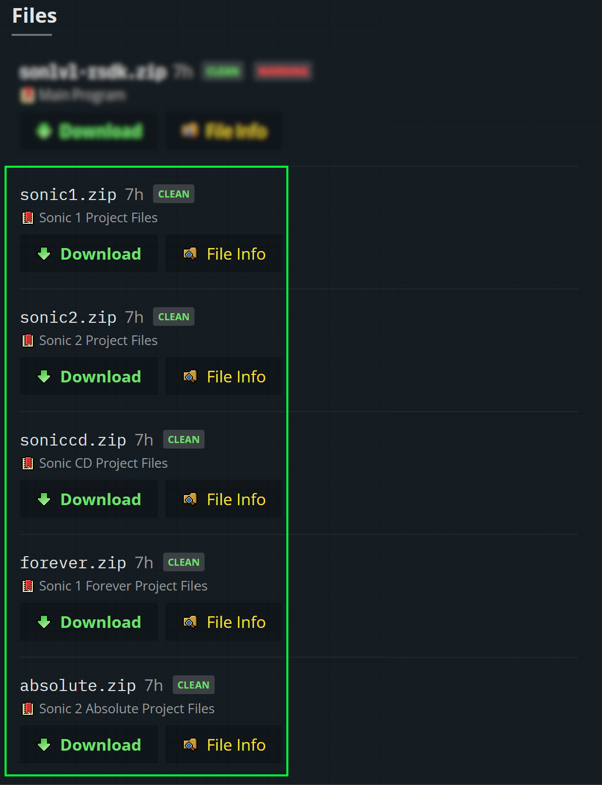
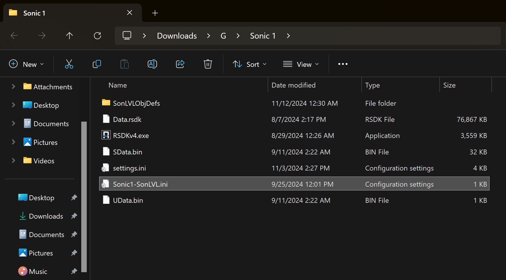
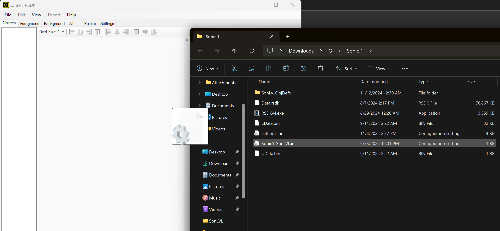
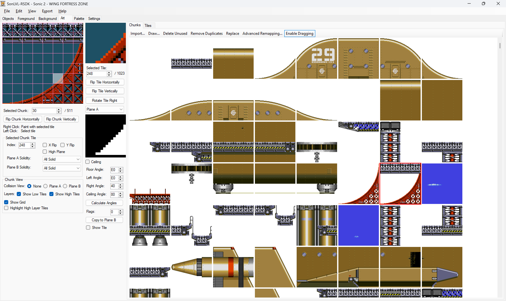

## SonLVL-RSDK: Getting Started

Welcome to the SonLVL-RSDK setup guide!
SonLVL-RSDK is a level editor designed for the Retro Engine versions of *Sonic 1*, *Sonic 2*, and *Sonic CD*, from editing existing levels to creating entirely brand new ones!
This guide will walk you through setting everything up and getting SonLVL-RSDK started for the first time.

### Step 1: Download SonLVL-RSDK

First, head over to the [SonLVL-RSDK releases page](https://github.com/Lavesiime/SonLVL-RSDK/releases) and download the latest version of the program. Once it's downloaded, just extract the files to any folder on your computer.

> **Warning:** Since SonLVL-RSDK works with multiple games, it’s best to keep it in its own folder. Don’t put it in the same folder as your game files - things can get a little messy that way!

	SonLVL-RSDK on the GitHub releases page. 
	

	SonLVL-RSDK extracted into its own folder. 
	

### Step 2: Grab the Project Files for Your Game

Next, on the same page, grab the project files for the game you want to edit. For example, if you’re working with *Sonic 1*, download the `Sonic1.zip` file.

	The project files on the GitHub releases page. Pick the one that matches your game! 
	

Extract the ZIP into the same folder as your game’s `.exe` file.

	The extracted project files. Make sure they're right next to your game! 
	

### Step 3: Open SonLVL-RSDK & Load Your Game

Now, open SonLVL-RSDK.exe. Drag and drop your game's SonLVL project file (included in the previous step) into the program window. For example, if you're working with *Sonic 1*, you would drag the `Sonic1-SonLVL.ini` file into the program (or `Sonic2-SonLVL.ini` for *Sonic 2*, or `SonicCD-SonLVL.ini` for *Sonic CD*, etc). Now your game should be loaded, and SonLVL-RSDK's icon and title should show that!

> **Warning:** Just make sure you’re dragging the *SonLVL.ini* file, not the *settings.ini* file  (which is part of the game files, not SonLVL's files, so you don't wanna use that one!)

	Just drag it over, and then.. 
	

### Step 4: Create Your Mod

Using the top navigation bar, go to **File** > **Select Mod** > **New Mod...** to create a new mod. Fill out the form with your mod's details, and you’re good to go!

> **Tip:** For next time, you don't need to manually drag your SonLVL.ini file or anything! Instead, after opening SonLVL-RSDK, you can just go to **File** > **Recent Mods**, and select both your game and your mod in one click!

	Now, create your mod.. 
	

### Step 5: Pick a Level & Start Editing!

Now, go to **File** > **Change Level...**, select a level, and edit to your heart's content!

	Go ahead and choose! 
	

### And You’re Ready to Go!

That’s it! You're all set to start creating and modding the levels for your favourite classic Sonic games! Dive in, play around, and have fun! If you ever get stuck or have any questions, from level creation to modding in general, feel free to join the [Retro Engine Modding Server](https://dc.railgun.works/retroengine)!

<!-- For further information, feel free to look around the rest of the [SonLVL-RSDK wiki](https://lavesiime.github.io/guides/sonlvl/wiki/)!-->

	 
	 
	 

