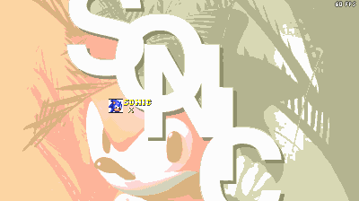
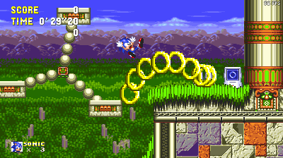
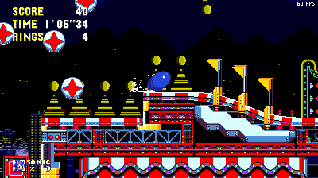
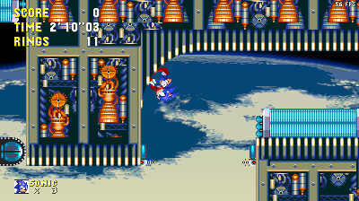
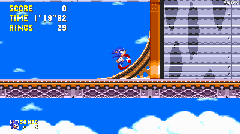

# The 3AIR Modders' Resource
***

<!-- Put everything in the centre, it looks pretty nice that way doesn't it?-->

<h2 id="custom-menu-framework">Custom Menu Framework</h2>
  
A framework to allow for custom menus.
Made by Airway1.
  <A HREF="../guides/rsdkv4/peelouts1/PlayerObject.txt">Download</A>

 

<h2 id="custom-monitors" align="center">Custom Monitors</h2>
  
A few extra custom monitors to add to your levels, along with a framework to add more. One of the custom monitors is the Hyper Ring monitor, which showcases the use of custom objects as well.
Made by GFX32.
  <A HREF="../guides/rsdkv4/peelouts1/PlayerObject.txt">Download</A>

 

<h2 id="spindash-sfx" align="center">Pitched Spindash SFX</h2>
  
A system to allow changing the spindash SFX, per-pitch.
Made by Airway1.
  <A HREF="../guides/rsdkv4/peelouts1/PlayerObject.txt">Download</A>

 

<h2 id="fake-classic-rot" align="center">Enforced Classic Rotation</h2>
  
A script that rotates the normal walking and running sprites when needed to effectively fake the Classic Rotation setting, without needing to actually create any other sprites <!-- notice how the description for my own work has the longest description LOL -->
Made by Lave sIime.
  <A HREF="../guides/rsdkv4/peelouts1/PlayerObject.txt">Download</A>

 

<h2 id="force-smooth-rot" align="center">Enforced Smooth Rotation</h2>
  
A script that forces the Smooth Rotation setting, so as to avoid needing to make extra rotated sprites.
Made by Lave sIime.
  <A HREF="../guides/rsdkv4/peelouts1/PlayerObject.txt">Download</A>
